# Perancangan Sistem

## Sistem Manajemen Parkir & Akses Kendaraan Perumahan

**Versi:** 1.0  
**Tanggal:** Januari 2025  
**Mata Kuliah:** Rekayasa Perangkat Lunak

---

## Daftar Isi

1. [Use Case Diagram](#1-use-case-diagram)
2. [Activity Diagram](#2-activity-diagram)
3. [Sequence Diagram](#3-sequence-diagram)
4. [Class Diagram](#4-class-diagram)
5. [Entity Relationship Diagram (ERD)](#5-entity-relationship-diagram-erd)
6. [State Machine Diagram](#6-state-machine-diagram)
7. [Desain Arsitektur](#7-desain-arsitektur)
8. [Desain API](#8-desain-api)
9. [UI Prototype](#9-ui-prototype)

---

## 1. Use Case Diagram

### 1.1 Diagram Utama

```mermaid
%%{init: {'theme': 'base', 'themeVariables': { 'primaryColor': '#10b981', 'primaryBorderColor': '#059669'}}}%%
graph TB
    subgraph Actors
        ADMIN((Admin))
        SATPAM((Satpam))
        WARGA((Warga))
        PENGELOLA((Pengelola))
    end

    subgraph System[Sistem Manajemen Parkir]
        %% Authentication
        UC1[Login]
        UC2[Logout]
        UC3[Manajemen Akun]
        
        %% Manajemen Kendaraan
        UC4[Registrasi Kendaraan]
        UC5[Update Data Kendaraan]
        UC6[Hapus Data Kendaraan]
        UC7[Lihat Daftar Kendaraan]
        
        %% Akses Masuk/Keluar
        UC8[Catat Akses Masuk]
        UC9[Catat Akses Keluar]
        UC10[Validasi Kendaraan]
        
        %% Parkir Tamu
        UC11[Registrasi Tamu]
        UC12[Batas Waktu Parkir Tamu]
        
        %% Pelanggaran & Denda
        UC13[Catat Pelanggaran]
        UC14[Hitung Denda]
        UC15[Update Pembayaran Denda]
        UC16[Lihat Histori Pelanggaran]
        
        %% Blacklist
        UC17[Tambah Blacklist]
        UC18[Hapus Blacklist]
        UC19[Cek Blacklist]
        
        %% Dashboard & Laporan
        UC20[Lihat Dashboard]
        UC21[Generate Laporan]
        UC22[Lihat Statistik]
    end

    %% Admin Relations
    ADMIN --> UC1
    ADMIN --> UC2
    ADMIN --> UC3
    ADMIN --> UC4
    ADMIN --> UC5
    ADMIN --> UC6
    ADMIN --> UC7
    ADMIN --> UC13
    ADMIN --> UC17
    ADMIN --> UC18
    ADMIN --> UC20
    ADMIN --> UC21

    %% Satpam Relations
    SATPAM --> UC1
    SATPAM --> UC2
    SATPAM --> UC8
    SATPAM --> UC9
    SATPAM --> UC10
    SATPAM --> UC11
    SATPAM --> UC13
    SATPAM --> UC19

    %% Warga Relations
    WARGA --> UC1
    WARGA --> UC2
    WARGA --> UC4
    WARGA --> UC5
    WARGA --> UC7
    WARGA --> UC16

    %% Pengelola Relations
    PENGELOLA --> UC1
    PENGELOLA --> UC2
    PENGELOLA --> UC20
    PENGELOLA --> UC21
    PENGELOLA --> UC22
```

### 1.2 Daftar Use Case

| ID | Use Case | Deskripsi | Aktor Utama |
|----|----------|-----------|-------------|
| UC-01 | Login | Masuk ke sistem dengan kredensial | Semua |
| UC-02 | Logout | Keluar dari sistem | Semua |
| UC-03 | Manajemen Akun | CRUD data pengguna | Admin |
| UC-04 | Registrasi Kendaraan | Mendaftarkan kendaraan baru | Warga, Admin |
| UC-05 | Update Data Kendaraan | Mengubah data kendaraan | Warga, Admin |
| UC-06 | Hapus Data Kendaraan | Menghapus data kendaraan | Admin |
| UC-07 | Lihat Daftar Kendaraan | Melihat list kendaraan terdaftar | Semua |
| UC-08 | Catat Akses Masuk | Mencatat waktu masuk kendaraan | Satpam |
| UC-09 | Catat Akses Keluar | Mencatat waktu keluar kendaraan | Satpam |
| UC-10 | Validasi Kendaraan | Memvalidasi status kendaraan | Satpam |
| UC-11 | Registrasi Tamu | Mencatat kendaraan tamu | Satpam |
| UC-12 | Batas Waktu Parkir Tamu | Monitoring waktu parkir tamu | Sistem |
| UC-13 | Catat Pelanggaran | Mencatat pelanggaran parkir | Satpam, Admin |
| UC-14 | Hitung Denda | Kalkulasi denda otomatis | Sistem |
| UC-15 | Update Pembayaran Denda | Update status pembayaran | Admin |
| UC-16 | Lihat Histori Pelanggaran | Melihat riwayat pelanggaran | Warga |
| UC-17 | Tambah Blacklist | Menambah ke daftar hitam | Admin |
| UC-18 | Hapus Blacklist | Menghapus dari daftar hitam | Admin |
| UC-19 | Cek Blacklist | Memeriksa status blacklist | Sistem |
| UC-20 | Lihat Dashboard | Melihat dashboard analitik | Admin, Pengelola |
| UC-21 | Generate Laporan | Membuat laporan | Admin, Pengelola |
| UC-22 | Lihat Statistik | Melihat statistik parkir | Pengelola |

---

## 2. Activity Diagram

### 2.1 Activity Diagram: Registrasi Kendaraan Warga

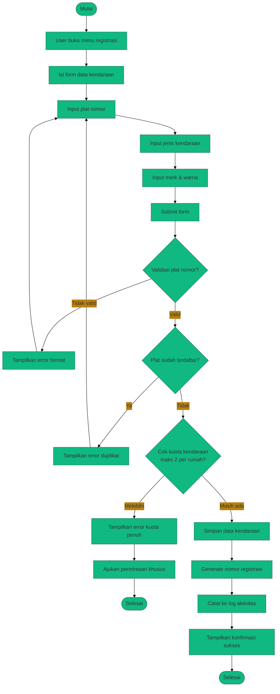

### 2.2 Activity Diagram: Akses Masuk Kendaraan

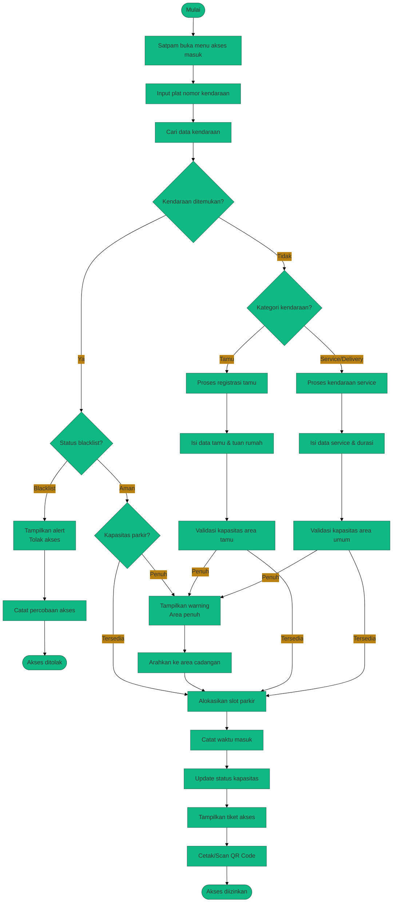

### 2.3 Activity Diagram: Akses Keluar Kendaraan

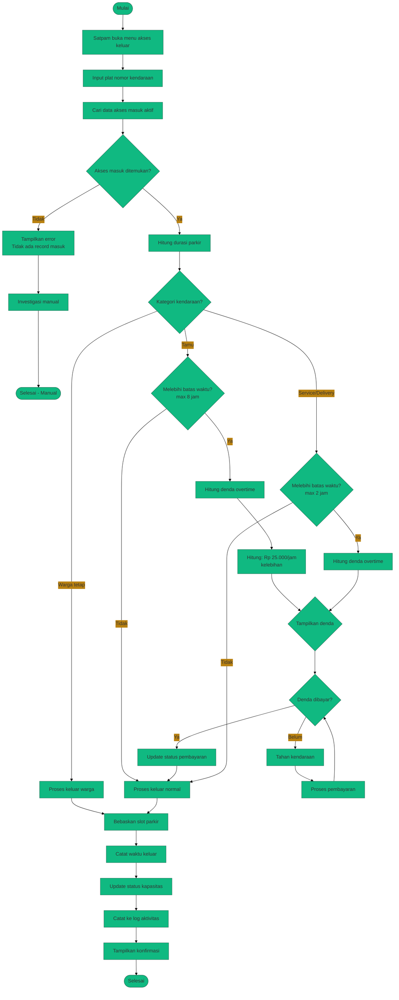

### 2.4 Activity Diagram: Pencatatan Pelanggaran

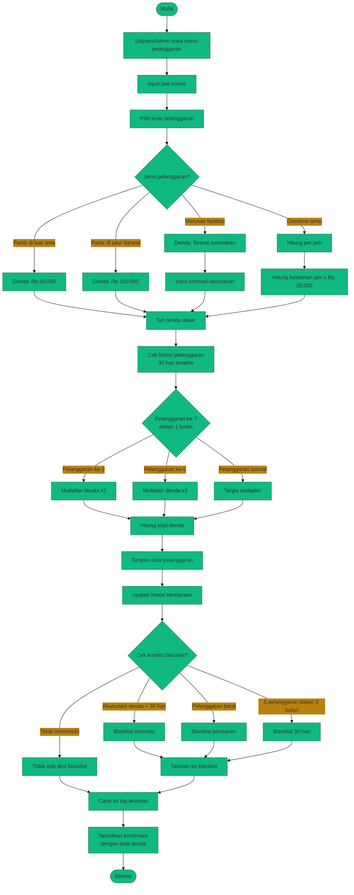

---

## 3. Sequence Diagram

### 3.1 Sequence Diagram: Login

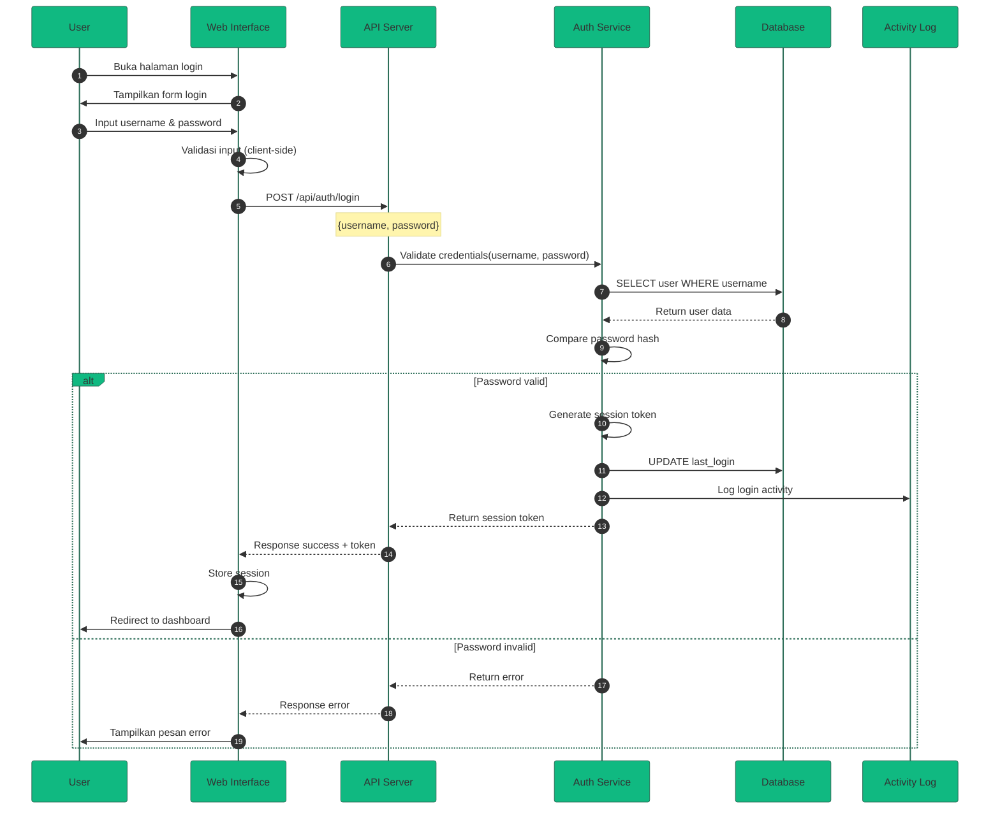

### 3.2 Sequence Diagram: Registrasi Kendaraan

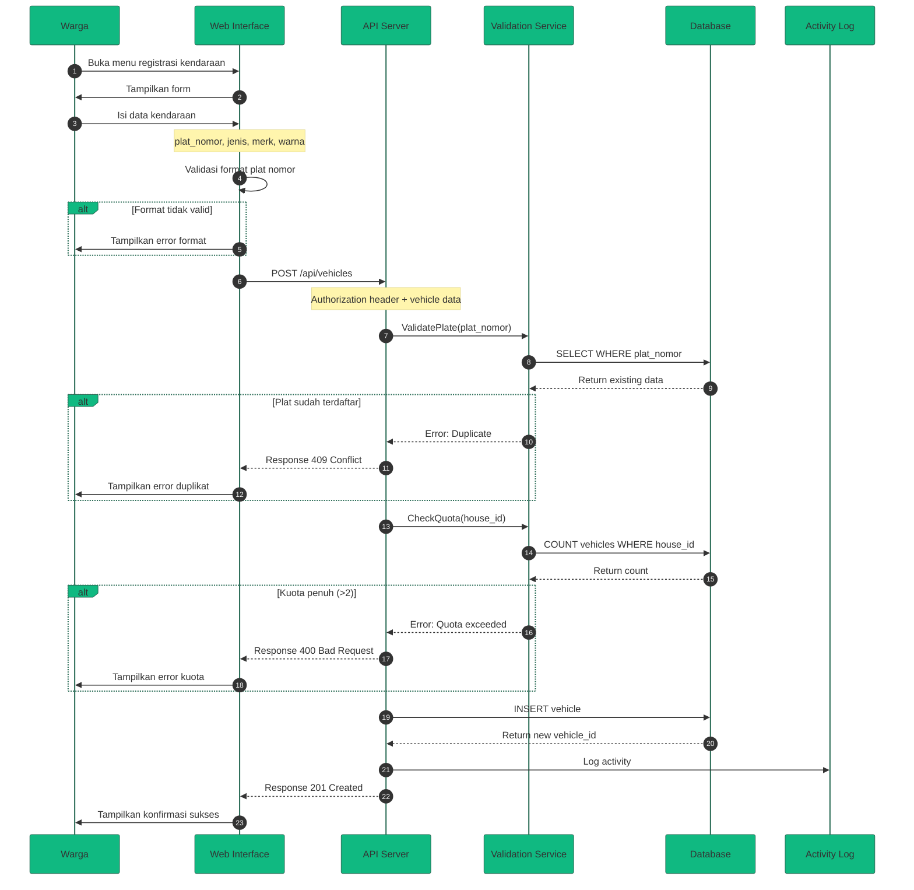

### 3.3 Sequence Diagram: Akses Masuk Kendaraan

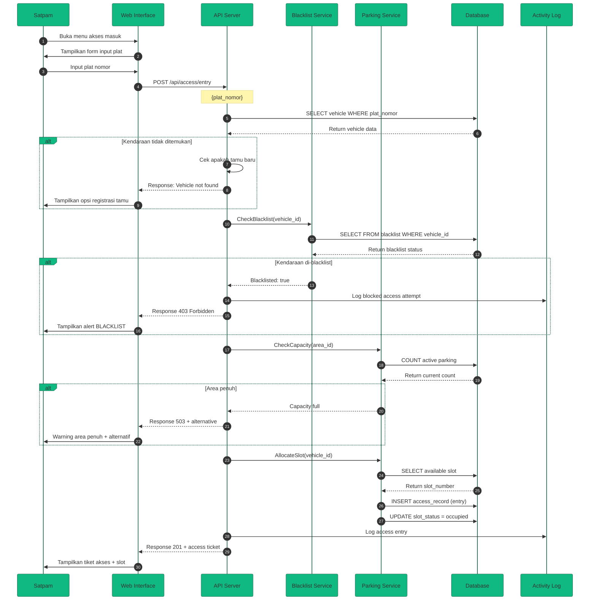

### 3.4 Sequence Diagram: Pencatatan Pelanggaran

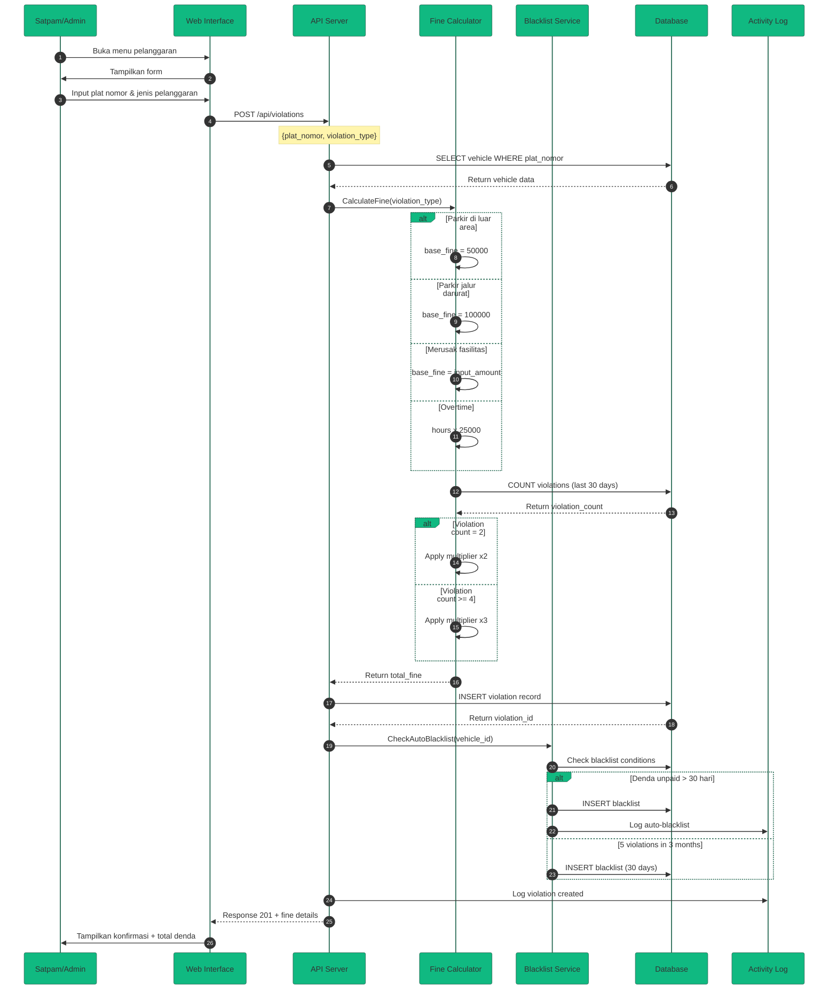

---

## 4. Class Diagram

### 4.1 Diagram Kelas Lengkap

```mermaid
%%{init: {'theme': 'base', 'themeVariables': { 'primaryColor': '#10b981'}}}%%
classDiagram
    %% User Management
    class User {
        +String id
        +String username
        +String password
        +String email
        +String fullName
        +String phone
        +String role
        +String status
        +DateTime createdAt
        +DateTime updatedAt
        +DateTime lastLogin
        +login()
        +logout()
        +updateProfile()
        +changePassword()
    }

    class Admin {
        +manageUsers()
        +manageVehicles()
        +generateReports()
        +manageBlacklist()
    }

    class Satpam {
        +recordAccess()
        +recordViolation()
        +registerGuest()
        +checkBlacklist()
    }

    class Warga {
        +registerVehicle()
        +viewHistory()
        +updateVehicle()
    }

    class Pengelola {
        +viewDashboard()
        +viewStatistics()
        +generateReports()
    }

    %% Property Management
    class House {
        +String id
        +String houseNumber
        +String address
        +String block
        +String status
        +DateTime createdAt
        +getVehicles()
        +getResidents()
        +checkQuota()
    }

    class Resident {
        +String id
        +String userId
        +String houseId
        +String relationship
        +DateTime registeredAt
        +getHouse()
        +getUser()
    }

    %% Vehicle Management
    class Vehicle {
        +String id
        +String platNumber
        +String vehicleType
        +String brand
        +String color
        +String category
        +String status
        +String houseId
        +DateTime registeredAt
        +getOwner()
        +getAccessHistory()
        +getViolations()
        +isBlacklisted()
    }

    class VehicleCategory {
        <<enumeration>>
        WARGA
        TAMU
        SERVICE
        DELIVERY
    }

    class VehicleType {
        <<enumeration>>
        MOTOR
        SEDAN
        MINIBUS
        PICKUP
        TRUK
    }

    %% Access Management
    class AccessRecord {
        +String id
        +String vehicleId
        +String accessType
        +DateTime entryTime
        +DateTime exitTime
        +String slotNumber
        +String areaId
        +String operatorId
        +String status
        +calculateDuration()
        +isOvertime()
        +getVehicle()
        +getOperator()
    }

    class GuestAccess {
        +String id
        +String accessRecordId
        +String hostHouseId
        +String purpose
        +Int maxDuration
        +DateTime expiredAt
        +getHost()
        +isExpired()
    }

    class ParkingArea {
        +String id
        +String name
        +String type
        +Int capacity
        +Int currentOccupancy
        +String status
        +getAvailableSlots()
        +isFull()
        +getOccupancyPercentage()
    }

    class ParkingSlot {
        +String id
        +String areaId
        +String slotNumber
        +String status
        +String vehicleId
        +DateTime occupiedAt
        +allocate()
        +release()
    }

    %% Violation Management
    class Violation {
        +String id
        +String vehicleId
        +String violationType
        +String description
        +Decimal baseFine
        +Decimal totalFine
        +Int multiplier
        +String status
        +String recordedBy
        +DateTime violationDate
        +DateTime paidAt
        +calculateFine()
        +applyMultiplier()
        +markAsPaid()
        +getVehicle()
    }

    class ViolationType {
        <<enumeration>>
        PARKIR_AREA_SALAH
        PARKIR_JALUR_DARURAT
        OVER_TIME
        MERUSAK_FASILITAS
        LAIN_LAIN
    }

    class ViolationHistory {
        +String id
        +String vehicleId
        +Int totalCount
        +Int monthCount
        +DateTime lastViolation
        +Decimal totalUnpaid
        +checkBlacklistCondition()
        +resetMonthly()
    }

    %% Blacklist Management
    class Blacklist {
        +String id
        +String vehicleId
        +String reason
        +String blacklistType
        +DateTime startDate
        +DateTime endDate
        +String addedBy
        +String status
        +isActive()
        +checkExpiry()
        +remove()
        +getVehicle()
    }

    class BlacklistType {
        <<enumeration>>
        PERMANENT
        TEMPORARY
        AUTO_DENDA
        AUTO_VIOLATION
    }

    %% Payment
    class Payment {
        +String id
        +String violationId
        +Decimal amount
        +String paymentMethod
        +String status
        +DateTime paidAt
        +String transactionId
        +process()
        +refund()
        +getViolation()
    }

    %% Logging
    class ActivityLog {
        +String id
        +String userId
        +String action
        +String module
        +String description
        +String ipAddress
        +DateTime timestamp
        +getDetails()
    }

    %% Relationships
    User <|-- Admin
    User <|-- Satpam
    User <|-- Warga
    User <|-- Pengelola
    
    User "1" -- "*" ActivityLog : creates
    House "1" -- "*" Vehicle : has
    House "1" -- "*" Resident : has
    Resident "*" -- "1" User : is
    Vehicle "*" -- "1" House : belongs_to
    Vehicle --> VehicleCategory : has
    Vehicle --> VehicleType : has
    Vehicle "1" -- "*" AccessRecord : has
    Vehicle "1" -- "*" Violation : has
    Vehicle "1" -- "0..1" Blacklist : may_have
    AccessRecord "1" -- "0..1" GuestAccess : extends
    GuestAccess "*" -- "1" House : visits
    ParkingArea "1" -- "*" ParkingSlot : contains
    ParkingSlot "*" -- "0..1" Vehicle : occupied_by
    AccessRecord "*" -- "1" ParkingSlot : uses
    Violation --> ViolationType : has
    Violation "1" -- "0..1" Payment : paid_by
    Violation "1" -- "1" ViolationHistory : updates
```

### 4.2 Detail Atribut Class

#### User
| Atribut | Tipe | Deskripsi |
|---------|------|-----------|
| id | String | Primary key (UUID) |
| username | String | Username unik |
| password | String | Password ter-hash |
| email | String | Email pengguna |
| fullName | String | Nama lengkap |
| phone | String | Nomor telepon |
| role | Enum | ADMIN, SATPAM, WARGA, PENGELOLA |
| status | Enum | ACTIVE, INACTIVE, SUSPENDED |
| createdAt | DateTime | Tanggal dibuat |
| updatedAt | DateTime | Tanggal diupdate |
| lastLogin | DateTime | Login terakhir |

#### Vehicle
| Atribut | Tipe | Deskripsi |
|---------|------|-----------|
| id | String | Primary key (UUID) |
| platNumber | String | Plat nomor kendaraan |
| vehicleType | Enum | Jenis kendaraan |
| brand | String | Merk kendaraan |
| color | String | Warna kendaraan |
| category | Enum | Kategori (WARGA, TAMU, SERVICE) |
| status | Enum | ACTIVE, INACTIVE, BLACKLISTED |
| houseId | String | FK ke House |
| registeredAt | DateTime | Tanggal registrasi |

#### AccessRecord
| Atribut | Tipe | Deskripsi |
|---------|------|-----------|
| id | String | Primary key (UUID) |
| vehicleId | String | FK ke Vehicle |
| accessType | Enum | ENTRY, EXIT |
| entryTime | DateTime | Waktu masuk |
| exitTime | DateTime | Waktu keluar |
| slotNumber | String | Nomor slot parkir |
| areaId | String | FK ke ParkingArea |
| operatorId | String | FK ke User (Satpam) |
| status | Enum | ACTIVE, COMPLETED |

#### Violation
| Atribut | Tipe | Deskripsi |
|---------|------|-----------|
| id | String | Primary key (UUID) |
| vehicleId | String | FK ke Vehicle |
| violationType | Enum | Jenis pelanggaran |
| description | String | Deskripsi detail |
| baseFine | Decimal | Denda dasar |
| totalFine | Decimal | Total denda (setelah multiplier) |
| multiplier | Int | Pengali denda |
| status | Enum | PENDING, PAID, WAIVED |
| recordedBy | String | FK ke User |
| violationDate | DateTime | Tanggal pelanggaran |
| paidAt | DateTime | Tanggal bayar |

#### Blacklist
| Atribut | Tipe | Deskripsi |
|---------|------|-----------|
| id | String | Primary key (UUID) |
| vehicleId | String | FK ke Vehicle |
| reason | String | Alasan blacklist |
| blacklistType | Enum | PERMANENT, TEMPORARY, AUTO |
| startDate | DateTime | Tanggal mulai |
| endDate | DateTime | Tanggal berakhir (nullable) |
| addedBy | String | FK ke User |
| status | Enum | ACTIVE, REMOVED, EXPIRED |

---

## 5. Entity Relationship Diagram (ERD)

### 5.1 ERD Lengkap

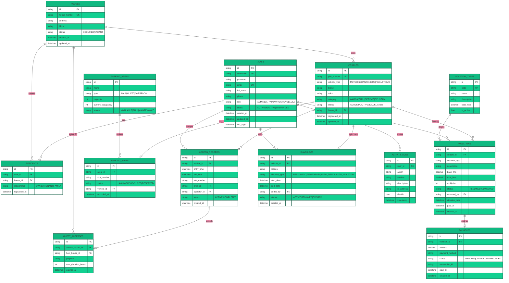

### 5.2 Kardinalitas Relationships

| Entity A | Relationship | Entity B | Kardinalitas |
|----------|--------------|----------|--------------|
| Users | has | Residents | 1 : N |
| Houses | contains | Residents | 1 : N |
| Houses | owns | Vehicles | 1 : N |
| Vehicles | has | AccessRecords | 1 : N |
| Vehicles | commits | Violations | 1 : N |
| Vehicles | may_have | Blacklists | 1 : 0..1 |
| Vehicles | occupies | ParkingSlots | 1 : 0..1 |
| AccessRecords | extends | GuestAccesses | 1 : 0..1 |
| Houses | visited_by | GuestAccesses | 1 : N |
| ParkingAreas | contains | ParkingSlots | 1 : N |
| Users | operates | AccessRecords | 1 : N |
| Users | records | Violations | 1 : N |
| Users | adds | Blacklists | 1 : N |
| Users | creates | ActivityLogs | 1 : N |
| Violations | paid_by | Payments | 1 : 0..1 |

---

## 6. State Machine Diagram

### 6.1 State Machine: Status Kendaraan

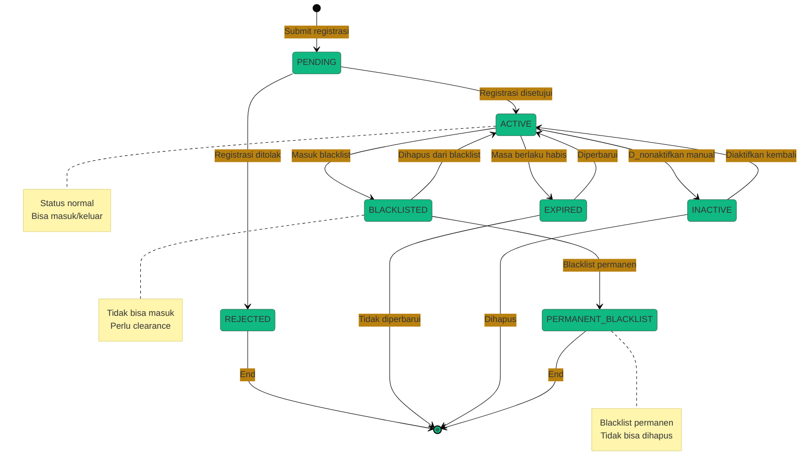

### 6.2 State Machine: Status Akses Parkir

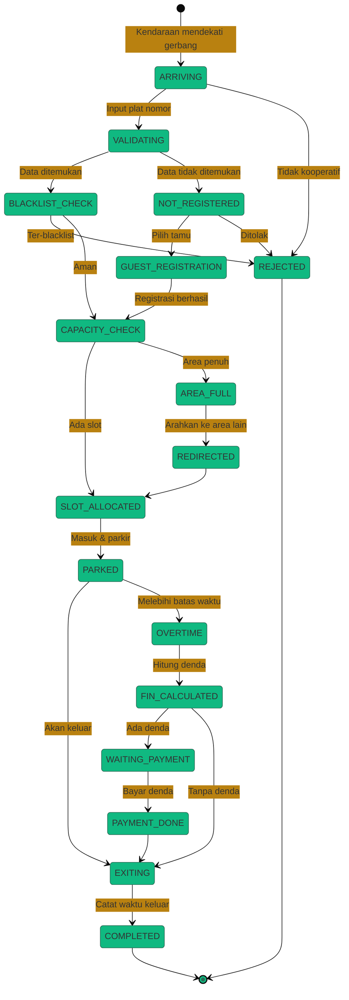

### 6.3 State Machine: Status Pelanggaran

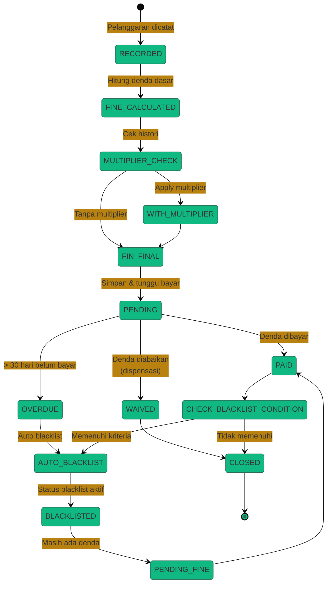

---

## 7. Desain Arsitektur

### 7.1 Arsitektur Layered (N-Tier)

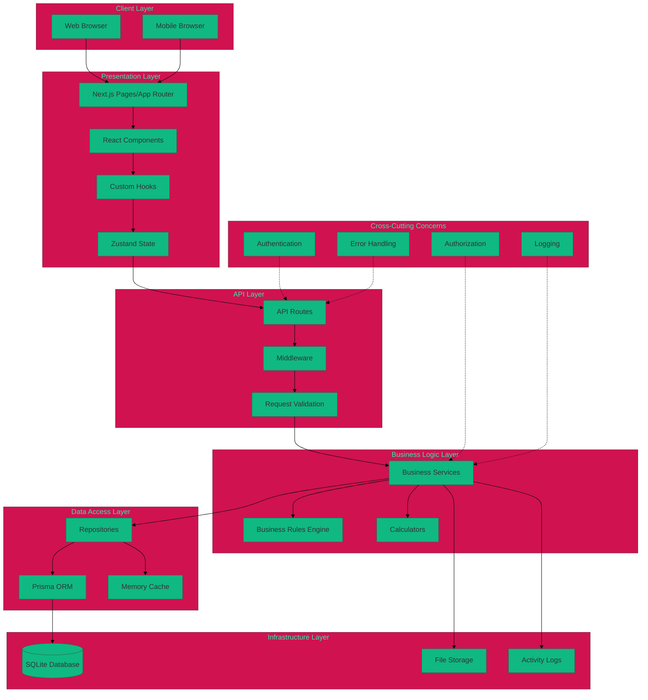

### 7.2 Struktur Folder

```
src/
├── app/                          # Next.js App Router
│   ├── (auth)/                   # Auth group routes
│   │   ├── login/
│   │   └── register/
│   ├── (dashboard)/              # Dashboard group routes
│   │   ├── admin/
│   │   ├── satpam/
│   │   ├── warga/
│   │   └── pengelola/
│   ├── api/                      # API Routes
│   │   ├── auth/
│   │   ├── vehicles/
│   │   ├── access/
│   │   ├── violations/
│   │   ├── blacklist/
│   │   ├── parking/
│   │   └── reports/
│   ├── layout.tsx
│   └── page.tsx
│
├── components/                   # React Components
│   ├── ui/                       # shadcn/ui components
│   ├── layout/                   # Layout components
│   │   ├── Header.tsx
│   │   ├── Sidebar.tsx
│   │   └── Footer.tsx
│   ├── forms/                    # Form components
│   │   ├── VehicleForm.tsx
│   │   ├── AccessForm.tsx
│   │   └── ViolationForm.tsx
│   ├── tables/                   # Table components
│   │   ├── VehicleTable.tsx
│   │   ├── AccessTable.tsx
│   │   └── ViolationTable.tsx
│   ├── charts/                   # Chart components
│   │   ├── AccessChart.tsx
│   │   ├── ViolationChart.tsx
│   │   └── CapacityChart.tsx
│   └── modals/                   # Modal components
│
├── lib/                          # Libraries & Utilities
│   ├── db.ts                     # Prisma client
│   ├── auth.ts                   # Auth utilities
│   ├── utils.ts                  # General utilities
│   └── validators.ts             # Input validators
│
├── services/                     # Business Logic Services
│   ├── auth.service.ts
│   ├── vehicle.service.ts
│   ├── access.service.ts
│   ├── violation.service.ts
│   ├── blacklist.service.ts
│   ├── parking.service.ts
│   └── report.service.ts
│
├── repositories/                 # Data Access Layer
│   ├── user.repository.ts
│   ├── vehicle.repository.ts
│   ├── access.repository.ts
│   ├── violation.repository.ts
│   └── blacklist.repository.ts
│
├── rules/                        # Business Rules
│   ├── fine-calculator.ts
│   ├── access-rules.ts
│   ├── blacklist-rules.ts
│   └── capacity-rules.ts
│
├── hooks/                        # Custom React Hooks
│   ├── useAuth.ts
│   ├── useVehicles.ts
│   ├── useAccess.ts
│   └── useDashboard.ts
│
├── stores/                       # Zustand Stores
│   ├── auth.store.ts
│   ├── ui.store.ts
│   └── notification.store.ts
│
├── types/                        # TypeScript Types
│   ├── user.types.ts
│   ├── vehicle.types.ts
│   ├── access.types.ts
│   ├── violation.types.ts
│   └── api.types.ts
│
└── constants/                    # Constants
    ├── roles.ts
    ├── violation-types.ts
    ├── fine-amounts.ts
    └── parking-config.ts
```

### 7.3 Deskripsi Layer

| Layer | Komponen | Tanggung Jawab |
|-------|----------|----------------|
| **Client** | Browser, Mobile | Menjalankan aplikasi web |
| **Presentation** | Pages, Components, Hooks | Menampilkan UI, interaksi user |
| **API** | Routes, Middleware | Menangani HTTP request/response |
| **Business Logic** | Services, Rules, Calculators | Logika bisnis dan perhitungan |
| **Data Access** | Repositories, Prisma, Cache | Akses dan manipulasi data |
| **Infrastructure** | Database, Files, Logs | Penyimpanan dan logging |

### 7.4 Cross-Cutting Concerns

| Concern | Implementasi |
|---------|--------------|
| **Authentication** | NextAuth.js dengan session-based auth |
| **Authorization** | RBAC middleware di API routes |
| **Logging** | Activity log service untuk semua aksi |
| **Error Handling** | Global error boundary + API error handler |
| **Validation** | Zod schema validation |
| **Caching** | In-memory cache untuk data sering diakses |

---

## 8. Desain API

### 8.1 API Endpoint Overview

| Modul | Method | Endpoint | Deskripsi | Auth |
|-------|--------|----------|-----------|------|
| **Auth** | POST | /api/auth/login | Login user | Public |
| | POST | /api/auth/logout | Logout user | Authenticated |
| | GET | /api/auth/me | Get current user | Authenticated |
| **Users** | GET | /api/users | List users | Admin |
| | POST | /api/users | Create user | Admin |
| | GET | /api/users/:id | Get user detail | Admin |
| | PUT | /api/users/:id | Update user | Admin |
| | DELETE | /api/users/:id | Delete user | Admin |
| **Vehicles** | GET | /api/vehicles | List vehicles | Authenticated |
| | POST | /api/vehicles | Register vehicle | Warga/Admin |
| | GET | /api/vehicles/:id | Get vehicle detail | Authenticated |
| | PUT | /api/vehicles/:id | Update vehicle | Owner/Admin |
| | DELETE | /api/vehicles/:id | Delete vehicle | Admin |
| **Access** | GET | /api/access | List access records | Authenticated |
| | POST | /api/access/entry | Record entry | Satpam |
| | PUT | /api/access/exit | Record exit | Satpam |
| | GET | /api/access/active | Get active parking | Satpam |
| **Guest** | POST | /api/guests | Register guest | Satpam |
| | GET | /api/guests | List guests | Satpam/Admin |
| | PUT | /api/guests/:id/extend | Extend duration | Satpam |
| **Violations** | GET | /api/violations | List violations | Authenticated |
| | POST | /api/violations | Create violation | Satpam/Admin |
| | PUT | /api/violations/:id/pay | Pay fine | Admin |
| | GET | /api/violations/history/:vehicleId | Get history | Authenticated |
| **Blacklist** | GET | /api/blacklist | List blacklist | Admin |
| | POST | /api/blacklist | Add to blacklist | Admin |
| | DELETE | /api/blacklist/:id | Remove from blacklist | Admin |
| | GET | /api/blacklist/check/:plate | Check status | Satpam |
| **Parking** | GET | /api/parking/areas | List areas | Authenticated |
| | GET | /api/parking/status | Get capacity status | Authenticated |
| | GET | /api/parking/slots | List available slots | Satpam |
| **Dashboard** | GET | /api/dashboard/stats | Get statistics | Admin/Pengelola |
| | GET | /api/dashboard/charts | Get chart data | Admin/Pengelola |
| **Reports** | GET | /api/reports/access | Access report | Admin/Pengelola |
| | GET | /api/reports/violations | Violation report | Admin/Pengelola |
| | GET | /api/reports/revenue | Revenue report | Admin/Pengelola |

### 8.2 Detail API Specification

#### 8.2.1 Authentication API

##### POST /api/auth/login
```typescript
// Request Body
interface LoginRequest {
  username: string;
  password: string;
}

// Response Success (200)
interface LoginResponse {
  success: true;
  data: {
    user: {
      id: string;
      username: string;
      fullName: string;
      role: UserRole;
    };
    token: string;
    expiresAt: string;
  };
}

// Response Error (401)
interface LoginErrorResponse {
  success: false;
  error: {
    code: "INVALID_CREDENTIALS";
    message: "Username atau password salah";
  };
}
```

##### GET /api/auth/me
```typescript
// Headers
// Authorization: Bearer <token>

// Response Success (200)
interface MeResponse {
  success: true;
  data: {
    id: string;
    username: string;
    email: string;
    fullName: string;
    phone: string;
    role: UserRole;
    house?: {
      id: string;
      houseNumber: string;
    };
  };
}
```

#### 8.2.2 Vehicle API

##### GET /api/vehicles
```typescript
// Query Parameters
interface VehicleQuery {
  page?: number;        // default: 1
  limit?: number;       // default: 10
  search?: string;      // search by plat number
  category?: string;    // WARGA | TAMU | SERVICE
  status?: string;      // ACTIVE | INACTIVE | BLACKLISTED
  houseId?: string;
}

// Response
interface VehicleListResponse {
  success: true;
  data: {
    vehicles: Vehicle[];
    pagination: {
      page: number;
      limit: number;
      total: number;
      totalPages: number;
    };
  };
}

interface Vehicle {
  id: string;
  platNumber: string;
  vehicleType: VehicleType;
  brand: string;
  color: string;
  category: VehicleCategory;
  status: VehicleStatus;
  house: {
    id: string;
    houseNumber: string;
    block: string;
  };
  registeredAt: string;
}
```

##### POST /api/vehicles
```typescript
// Request Body
interface CreateVehicleRequest {
  platNumber: string;     // Format: "B 1234 ABC"
  vehicleType: VehicleType;
  brand: string;
  color: string;
  category: VehicleCategory;
  houseId?: string;       // Optional for admin
}

// Response Success (201)
interface CreateVehicleResponse {
  success: true;
  data: {
    id: string;
    platNumber: string;
    message: "Kendaraan berhasil didaftarkan";
  };
}

// Response Error (400)
interface ValidationError {
  success: false;
  error: {
    code: "VALIDATION_ERROR";
    message: string;
    details: {
      field: string;
      message: string;
    }[];
  };
}

// Response Error (409)
interface DuplicateError {
  success: false;
  error: {
    code: "DUPLICATE_PLAT_NUMBER";
    message: "Plat nomor sudah terdaftar";
  };
}

// Response Error (403)
interface QuotaExceededError {
  success: false;
  error: {
    code: "QUOTA_EXCEEDED";
    message: "Kuota kendaraan untuk rumah ini sudah penuh (maksimal 2)";
  };
}
```

#### 8.2.3 Access API

##### POST /api/access/entry
```typescript
// Request Body
interface AccessEntryRequest {
  platNumber: string;
  areaId?: string;        // Optional, auto-assign if not provided
}

// Response Success (200)
interface AccessEntryResponse {
  success: true;
  data: {
    accessId: string;
    vehicle: {
      id: string;
      platNumber: string;
      category: VehicleCategory;
      owner: string;
    };
    slot: {
      slotNumber: string;
      area: string;
    };
    entryTime: string;
    maxDuration?: number;  // For guests, in hours
    expiresAt?: string;    // For guests
  };
}

// Response Error (403)
interface BlacklistError {
  success: false;
  error: {
    code: "VEHICLE_BLACKLISTED";
    message: "Kendaraan ini dilarang masuk";
    details: {
      reason: string;
      blacklistedAt: string;
    };
  };
}

// Response Error (503)
interface CapacityFullError {
  success: false;
  error: {
    code: "PARKING_FULL";
    message: "Area parkir penuh";
    alternatives: {
      areaId: string;
      areaName: string;
      availableSlots: number;
    }[];
  };
}
```

##### PUT /api/access/exit
```typescript
// Request Body
interface AccessExitRequest {
  platNumber: string;
}

// Response Success (200)
interface AccessExitResponse {
  success: true;
  data: {
    accessId: string;
    platNumber: string;
    entryTime: string;
    exitTime: string;
    duration: number;      // in minutes
    fine?: {
      amount: number;
      reason: string;
      hoursOvertime: number;
    };
  };
}

// Response with Fine Required
interface FineRequiredResponse {
  success: false;
  error: {
    code: "FINE_REQUIRED";
    message: "Ada denda yang harus dibayar";
    details: {
      fineAmount: number;
      violation: {
        id: string;
        type: string;
        amount: number;
      };
    };
  };
}
```

#### 8.2.4 Violation API

##### POST /api/violations
```typescript
// Request Body
interface CreateViolationRequest {
  platNumber: string;
  violationType: ViolationType;
  description?: string;
  customAmount?: number;   // For MERUSAK_FASILITAS
}

// Response Success (201)
interface CreateViolationResponse {
  success: true;
  data: {
    id: string;
    vehicle: {
      platNumber: string;
    };
    violationType: string;
    baseFine: number;
    multiplier: number;
    totalFine: number;
    recentViolationCount: number;
    autoBlacklist?: {
      triggered: boolean;
      reason?: string;
      duration?: number;
    };
  };
}
```

#### 8.2.5 Dashboard API

##### GET /api/dashboard/stats
```typescript
// Response
interface DashboardStatsResponse {
  success: true;
  data: {
    today: {
      totalEntries: number;
      totalExits: number;
      currentParked: number;
      guests: number;
    };
    parking: {
      mainArea: {
        capacity: number;
        occupied: number;
        available: number;
        percentage: number;
      };
      guestArea: {
        capacity: number;
        occupied: number;
        available: number;
        percentage: number;
      };
    };
    violations: {
      today: number;
      thisWeek: number;
      thisMonth: number;
      pendingFines: number;
      totalUnpaid: number;
    };
    alerts: {
      type: "WARNING" | "CRITICAL" | "INFO";
      message: string;
      timestamp: string;
    }[];
  };
}
```

### 8.3 Error Response Format

```typescript
// Standard Error Response
interface APIError {
  success: false;
  error: {
    code: string;          // Error code
    message: string;       // User-friendly message
    details?: any;         // Additional details
    stack?: string;        // Stack trace (dev only)
  };
  timestamp: string;
  path: string;
}
```

### 8.4 HTTP Status Codes

| Status Code | Penggunaan |
|-------------|------------|
| 200 | Success - GET, PUT |
| 201 | Created - POST |
| 204 | No Content - DELETE |
| 400 | Bad Request - Validation error |
| 401 | Unauthorized - Not authenticated |
| 403 | Forbidden - No permission |
| 404 | Not Found - Resource not found |
| 409 | Conflict - Duplicate resource |
| 422 | Unprocessable Entity - Business rule violation |
| 500 | Internal Server Error |
| 503 | Service Unavailable - Parking full |

---

## 9. UI Prototype

### 9.1 Wireframe Layouts

#### 9.1.1 Login Page

```
┌─────────────────────────────────────────────────────────────┐
│                                                             │
│                    🏠 SISTEM PARKIR PERUMAHAN               │
│                                                             │
│              ┌─────────────────────────────┐                │
│              │                             │                │
│              │   Username                  │                │
│              │   ┌─────────────────────┐   │                │
│              │   │                     │   │                │
│              │   └─────────────────────┘   │                │
│              │                             │                │
│              │   Password                  │                │
│              │   ┌─────────────────────┐   │                │
│              │   │ ••••••••            │   │                │
│              │   └─────────────────────┘   │                │
│              │                             │                │
│              │   ┌─────────────────────┐   │                │
│              │   │       LOGIN         │   │                │
│              │   └─────────────────────┘   │                │
│              │                             │                │
│              │   Lupa Password?            │                │
│              │                             │                │
│              └─────────────────────────────┘                │
│                                                             │
└─────────────────────────────────────────────────────────────┘
```

#### 9.1.2 Dashboard Admin

```
┌─────────────────────────────────────────────────────────────────────────┐
│ 🏠 LOGO    │ Dashboard │ Kendaraan │ Akses │ Pelanggaran │ Blacklist │  │
├─────────────────────────────────────────────────────────────────────────┤
│                                                                         │
│  ┌──────────┐ ┌──────────┐ ┌──────────┐ ┌──────────┐                   │
│  │ Kendaraan│ │  Parkir  │ │ Pelanggar│ │   Denda  │                   │
│  │   156    │ │   45/100 │ │    12    │ │ Rp 1.2jt │                   │
│  │  Active  │ │  45%     │ │  Today   │ │ Unpaid   │                   │
│  └──────────┘ └──────────┘ └──────────┘ └──────────┘                   │
│                                                                         │
│  ┌─────────────────────────────────┐ ┌─────────────────────────────┐   │
│  │     GRAFIK AKSES MINGGUAN       │ │     STATUS PARKIR           │   │
│  │                                 │ │                             │   │
│  │   ▓▓▓▓▓                         │ │  Main Area:                 │   │
│  │         ▓▓▓▓▓▓▓                 │ │  ████████████░░░░░░ 65%     │   │
│  │               ▓▓▓▓▓             │ │                             │   │
│  │                     ▓▓▓▓        │ │  Guest Area:                │   │
│  │                          ▓▓     │ │  ████████░░░░░░░░░░ 40%     │   │
│  │  Sen Sel Rab Kam Jum Sab Min    │ │                             │   │
│  └─────────────────────────────────┘ └─────────────────────────────┘   │
│                                                                         │
│  ┌──────────────────────────────────────────────────────────────────┐  │
│  │                    AKTIVITAS TERKINI                              │  │
│  ├──────────────────────────────────────────────────────────────────┤  │
│  │ 10:23 │ B 1234 ABC │ Masuk  │ Area A - Slot 15                   │  │
│  │ 10:21 │ D 5678 XY  │ Keluar │ Durasi: 2 jam 15 menit             │  │
│  │ 10:15 │ F 9012 ZZ  │ Blacklist Alert │ Plat terdeteksi blacklist│  │
│  │ 10:10 │ B 3456 DEF │ Pelanggaran │ Parkir di jalur darurat       │  │
│  └──────────────────────────────────────────────────────────────────┘  │
│                                                                         │
├─────────────────────────────────────────────────────────────────────────┤
│                              © 2025 Sistem Parkir                       │
└─────────────────────────────────────────────────────────────────────────┘
```

#### 9.1.3 Halaman Akses Masuk (Satpam)

```
┌─────────────────────────────────────────────────────────────────────────┐
│ ☰ MENU                          AKSES MASUK KENDARAAN                  │
├─────────────────────────────────────────────────────────────────────────┤
│                                                                         │
│  ┌─────────────────────────────────────────────────────────────────┐   │
│  │                                                                   │   │
│  │    PLAT NOMOR                                                    │   │
│  │    ┌───────────────────────────────────────────────┐             │   │
│  │    │  B  1234  ABC                                │  SCAN 📷   │   │
│  │    └───────────────────────────────────────────────┘             │   │
│  │                                                                   │   │
│  │    ┌─────────────────┐   ┌─────────────────┐                     │   │
│  │    │    CEK PLAT     │   │    DAFTAR TAMU  │                     │   │
│  │    └─────────────────┘   └─────────────────┘                     │   │
│  │                                                                   │   │
│  └─────────────────────────────────────────────────────────────────┘   │
│                                                                         │
│  ┌─────────────────────────────────────────────────────────────────┐   │
│  │  ⚠️ ALERT: KENDARAAN BLACKLIST                                   │   │
│  │                                                                   │   │
│  │  Plat: B 1234 ABC                                                │   │
│  │  Alasan: Denda belum dibayar > 30 hari                          │   │
│  │  Total Denda: Rp 350.000                                         │   │
│  │                                                                   │   │
│  │  ┌─────────────────┐   ┌─────────────────┐                      │   │
│  │  │    TOLAK AKSES  │   │   KONFIRMASI    │                      │   │
│  │  └─────────────────┘   └─────────────────┘                      │   │
│  └─────────────────────────────────────────────────────────────────┘   │
│                                                                         │
│  ┌─────────────────────────────────────────────────────────────────┐   │
│  │  ✅ AKSES DIIZINKAN                                              │   │
│  │                                                                   │   │
│  │  Kendaraan: B 1234 ABC (Honda Beat - Hitam)                     │   │
│  │  Pemilik: Budi Santoso (Blok A-12)                              │   │
│  │  Slot: A-15                                                      │   │
│  │                                                                   │   │
│  │  ┌─────────────────┐   ┌─────────────────┐                      │   │
│  │  │    CETAK TIKET  │   │    SELESAI      │                      │   │
│  │  └─────────────────┘   └─────────────────┘                      │   │
│  └─────────────────────────────────────────────────────────────────┘   │
│                                                                         │
└─────────────────────────────────────────────────────────────────────────┘
```

#### 9.1.4 Halaman Registrasi Kendaraan (Warga)

```
┌─────────────────────────────────────────────────────────────────────────┐
│ ☰ MENU                          REGISTRASI KENDARAAN                   │
├─────────────────────────────────────────────────────────────────────────┤
│                                                                         │
│  Data Rumah: Blok A-12                                                  │
│  Kuota: 1/2 kendaraan terdaftar                                        │
│                                                                         │
│  ┌─────────────────────────────────────────────────────────────────┐   │
│  │                                                                   │   │
│  │  Plat Nomor *                                                    │   │
│  │  ┌─────────────────────────────────────────────┐                 │   │
│  │  │ B 1234 ABC                                  │                 │   │
│  │  └─────────────────────────────────────────────┘                 │   │
│  │                                                                   │   │
│  │  Jenis Kendaraan *                                               │   │
│  │  ┌─────────────────────────────────────────────┐                 │   │
│  │  │ Motor ▼                                     │                 │   │
│  │  └─────────────────────────────────────────────┘                 │   │
│  │                                                                   │   │
│  │  Merk *                      Warna *                             │   │
│  │  ┌───────────────────┐       ┌───────────────────┐               │   │
│  │  │ Honda             │       │ Hitam ▼           │               │   │
│  │  └───────────────────┘       └───────────────────┘               │   │
│  │                                                                   │   │
│  │  ┌─────────────────────────────────────────────────────────┐     │   │
│  │  │                      DAFTARKAN                          │     │   │
│  │  └─────────────────────────────────────────────────────────┘     │   │
│  │                                                                   │   │
│  └─────────────────────────────────────────────────────────────────┘   │
│                                                                         │
│  ┌─────────────────────────────────────────────────────────────────┐   │
│  │  KENDARAAN TERDAFTAR                                             │   │
│  ├─────────────────────────────────────────────────────────────────┤   │
│  │  Plat        │ Jenis  │ Merk     │ Warna │ Status               │   │
│  │  B 1234 ABC  │ Motor  │ Honda    │ Hitam │ Aktif               │   │
│  │  D 5678 XY   │ Sedan  │ Toyota   │ Putih │ Aktif               │   │
│  └─────────────────────────────────────────────────────────────────┘   │
│                                                                         │
└─────────────────────────────────────────────────────────────────────────┘
```

### 9.2 Responsive Design Breakpoints

| Breakpoint | Width | Layout |
|------------|-------|--------|
| Mobile | < 640px | Single column, hamburger menu |
| Tablet | 640px - 1024px | Two columns, collapsible sidebar |
| Desktop | > 1024px | Full layout, fixed sidebar |

### 9.3 Color Scheme

| Element | Light Mode | Dark Mode |
|---------|------------|-----------|
| Primary | #10b981 (Emerald) | #10b981 |
| Background | #ffffff | #1a1a2e |
| Surface | #f8fafc | #16213e |
| Text | #1e293b | #e2e8f0 |
| Success | #22c55e | #22c55e |
| Warning | #f59e0b | #f59e0b |
| Error | #ef4444 | #ef4444 |
| Info | #3b82f6 | #3b82f6 |

---

## Lampiran

### A. Daftar File Diagram

| No | Diagram | File | Format |
|----|---------|------|--------|
| 1 | Use Case Diagram | system-design.md | Mermaid |
| 2 | Activity Diagram | system-design.md | Mermaid |
| 3 | Sequence Diagram | system-design.md | Mermaid |
| 4 | Class Diagram | system-design.md | Mermaid |
| 5 | ERD | system-design.md | Mermaid |
| 6 | State Machine Diagram | system-design.md | Mermaid |
| 7 | Architecture Diagram | system-design.md | Mermaid |

### B. Tools yang Digunakan

| Tool | Kegunaan |
|------|----------|
| Mermaid | Diagram generation |
| Figma | UI Prototype (referensi) |
| VS Code | Editor |
| Draw.io | Alternative diagram |

---

**Dokumen ini disusun untuk memenuhi tugas proyek semester mata kuliah Rekayasa Perangkat Lunak.**
